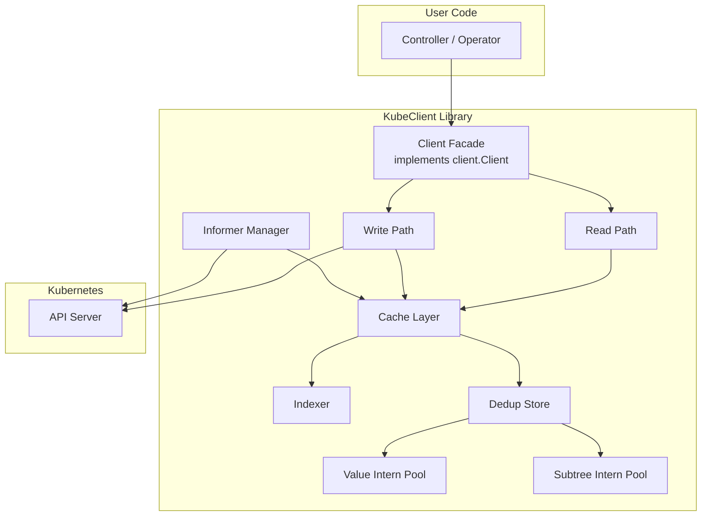
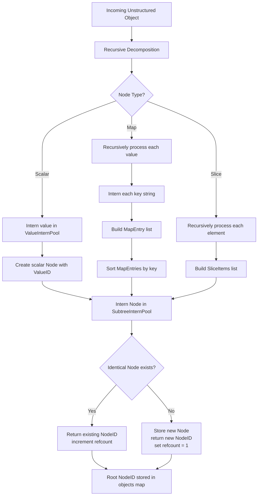
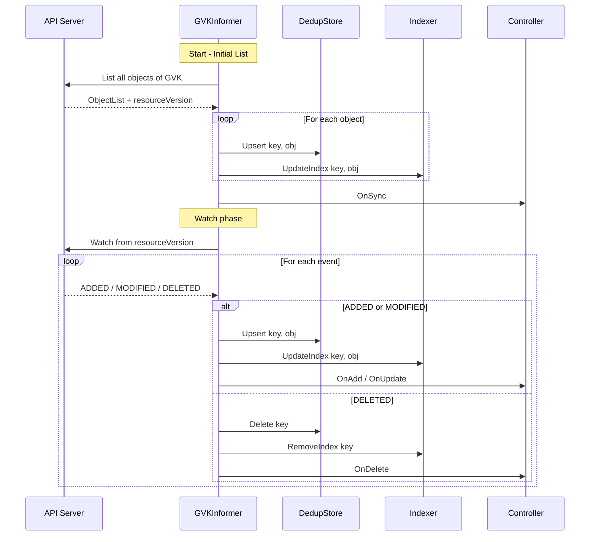
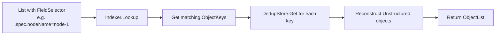
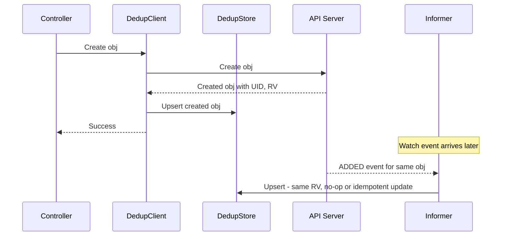
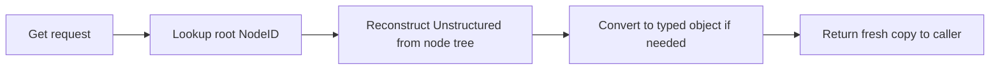
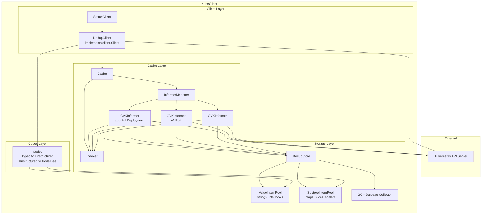

# KubeClient — Deduplicated-Cache Kubernetes Client Library

## 1. Overview

**KubeClient** is a Go library that provides a Kubernetes client with an intelligent, memory-efficient cache. It is compatible with the `client.Client` interface from `sigs.k8s.io/controller-runtime`, making it a drop-in replacement for existing controllers and operators.

The core innovation is a **deduplicated storage engine** that stores `Unstructured` objects by interning individual values and deduplicating identical subtrees. For clusters with thousands of similar objects (e.g., Deployments generated from a template), this can reduce memory usage by 60-90% compared to a standard informer cache.

### Key Features

- **Global deduplication** across all Kinds — identical field values and subtrees are stored once
- **Value-level interning** — strings, numbers, booleans stored once and referenced by ID
- **Subtree deduplication** — entire sub-objects (maps, slices) hashed and stored once
- **Watch/Informer pattern** — cache populated via Kubernetes Watch API
- **Write-through cache** — Create/Update/Delete operations update both the API server and cache
- **Custom indexing** — efficient lookups by arbitrary fields
- **Concurrent-safe** — safe for use from multiple goroutines
- **controller-runtime compatible** — implements `client.Client` interface

---

## 2. Architecture Overview



---

## 3. Package Structure

```
kubeclient/
├── go.mod
├── go.sum
├── README.md
├── client.go                  # Client facade, implements client.Client
├── client_options.go          # Functional options for client construction
├── cache/
│   ├── cache.go               # Cache interface and main implementation
│   ├── informer.go            # Informer manager — Watch/List lifecycle
│   ├── informer_map.go        # GVK -> Informer mapping
│   ├── index.go               # Indexing subsystem
│   └── index_test.go
├── store/
│   ├── store.go               # DedupStore — main storage engine interface
│   ├── dedup_store.go         # DedupStore implementation
│   ├── dedup_store_test.go
│   ├── intern.go              # Value intern pool
│   ├── intern_test.go
│   ├── subtree.go             # Subtree intern pool
│   ├── subtree_test.go
│   ├── node.go                # Internal tree node representation
│   └── node_test.go
├── codec/
│   ├── codec.go               # Encode/decode between Unstructured and internal repr
│   └── codec_test.go
├── internal/
│   ├── gvk.go                 # GVK utilities
│   └── key.go                 # Object key utilities (namespace/name)
└── tests/
    ├── integration/
    │   ├── cache_test.go
    │   └── client_test.go
    └── benchmark/
        ├── memory_test.go
        └── throughput_test.go
```

---

## 4. Deduplication Storage Engine

This is the core of the library. The storage engine breaks down each `Unstructured` object into a tree of nodes, where each node can be a **leaf** (scalar value) or a **branch** (map or slice). Identical values and subtrees are stored only once.

### 4.1 Internal Node Representation

Every Kubernetes unstructured object is `map[string]interface{}`. We decompose this recursively into a tree of `Node` values:

```go
// store/node.go

// NodeID is a unique identifier for a node in the store.
type NodeID uint64

// NodeKind represents the type of a node.
type NodeKind byte

const (
    NodeKindScalar NodeKind = iota  // string, int64, float64, bool, nil
    NodeKindMap                      // map[string]interface{}
    NodeKindSlice                    // []interface{}
)

// Node represents a single node in the decomposed object tree.
type Node struct {
    Kind     NodeKind
    // For NodeKindScalar: ValueID points into the ValueInternPool
    ValueID  ValueID
    // For NodeKindMap: ordered list of key-value pairs
    // Keys are interned strings (ValueID), Values are NodeIDs
    MapEntries []MapEntry
    // For NodeKindSlice: ordered list of child NodeIDs
    SliceItems []NodeID
}

// MapEntry is a key-value pair in a map node.
type MapEntry struct {
    Key   ValueID  // interned string key
    Value NodeID   // child node
}
```

### 4.2 Value Intern Pool

The value intern pool stores unique scalar values and returns a compact `ValueID` for each. Identical values always map to the same `ValueID`.

```go
// store/intern.go

// ValueID is a unique identifier for an interned value.
type ValueID uint64

// ValueInternPool stores unique scalar values.
type ValueInternPool struct {
    mu       sync.RWMutex
    values   []interface{}          // ValueID -> value
    index    map[interface{}]ValueID // value -> ValueID (for strings, ints, floats, bools)
}

// Intern returns the ValueID for the given value, creating a new entry if needed.
func (p *ValueInternPool) Intern(v interface{}) ValueID

// Resolve returns the original value for a ValueID.
func (p *ValueInternPool) Resolve(id ValueID) interface{}
```

**What gets interned:**
- `string` — field names, label keys/values, annotation keys/values, image names, etc.
- `int64` — replicas count, port numbers, etc.
- `float64` — resource quantities
- `bool` — true/false flags
- `nil` — single entry

This is extremely effective because Kubernetes objects share enormous amounts of string values: `"metadata"`, `"spec"`, `"status"`, `"labels"`, `"name"`, `"namespace"`, `"containers"`, common label values like `"app"`, annotation keys, etc.

### 4.3 Subtree Intern Pool

The subtree intern pool stores unique `Node` subtrees. When a map or slice node is constructed, it is hashed and checked against the pool. If an identical subtree already exists, the existing `NodeID` is returned.

```go
// store/subtree.go

// SubtreeInternPool stores unique node subtrees.
type SubtreeInternPool struct {
    mu     sync.RWMutex
    nodes  []Node                    // NodeID -> Node
    index  map[uint64][]NodeID       // hash -> candidate NodeIDs (for collision handling)
}

// Intern stores a node and returns its NodeID.
// If an identical node already exists, returns the existing NodeID.
func (p *SubtreeInternPool) Intern(node Node) NodeID

// Resolve returns the Node for a given NodeID.
func (p *SubtreeInternPool) Resolve(id NodeID) Node

// hash computes a hash of a Node for deduplication lookup.
func (p *SubtreeInternPool) hash(node Node) uint64
```

**Hashing strategy:**
- Scalar nodes: hash the `ValueID`
- Map nodes: hash the sorted sequence of `(KeyValueID, ChildNodeID)` pairs
- Slice nodes: hash the ordered sequence of child `NodeID`s

Since child nodes are already interned (same content = same `NodeID`), the hash of a parent node is **deterministic and content-addressable** — identical subtrees always produce the same hash.

### 4.4 DedupStore — Main Storage Engine

```go
// store/dedup_store.go

// ObjectKey uniquely identifies a Kubernetes object.
type ObjectKey struct {
    GVK       schema.GroupVersionKind
    Namespace string
    Name      string
}

// DedupStore is the main deduplicated storage engine.
type DedupStore struct {
    mu        sync.RWMutex
    values    *ValueInternPool
    subtrees  *SubtreeInternPool
    
    // objects maps each object key to its root NodeID
    objects   map[ObjectKey]NodeID
    
    // refcounts tracks how many objects reference each NodeID
    // Used for garbage collection of unreferenced subtrees
    refcounts map[NodeID]uint32
}

// Upsert adds or updates an object in the store.
func (s *DedupStore) Upsert(key ObjectKey, obj *unstructured.Unstructured) error

// Delete removes an object from the store.
func (s *DedupStore) Delete(key ObjectKey) error

// Get retrieves an object from the store, reconstructing it from the dedup tree.
func (s *DedupStore) Get(key ObjectKey) (*unstructured.Unstructured, bool)

// List returns all objects matching the given GVK and optional label/field selectors.
func (s *DedupStore) List(gvk schema.GroupVersionKind, opts ...ListOption) []*unstructured.Unstructured
```

### 4.5 Deduplication Flow



### 4.6 Memory Savings Example

Consider 1000 Deployments created from the same template, differing only in `metadata.name`, `metadata.uid`, `metadata.resourceVersion`, and `status`:

| Component | Standard Cache | DedupStore |
|-----------|---------------|------------|
| `spec.template.spec` (identical) | 1000 copies | 1 copy |
| `spec.selector` (identical) | 1000 copies | 1 copy |
| `metadata.labels` (identical) | 1000 copies | 1 copy |
| Common strings like `apps/v1`, `Deployment` | 1000 copies each | 1 copy each |
| Unique fields (name, uid, resourceVersion) | 1000 entries | 1000 entries |
| **Estimated savings** | — | **~70-85%** |

### 4.7 Garbage Collection

When an object is updated or deleted, subtrees that are no longer referenced need to be cleaned up. The store uses **reference counting**:

```go
// When a node is referenced by a new object root, increment refcount
// When an object is deleted or updated (old root replaced), decrement refcount
// When refcount reaches 0, the node can be reclaimed

// GC runs periodically or when memory pressure is detected
func (s *DedupStore) GC() GCStats
```

The GC is **generational** — recently created nodes are checked more frequently since they are more likely to be short-lived (e.g., status updates).

---

## 5. Cache Layer

The cache layer sits on top of the `DedupStore` and manages the lifecycle of informers (Watch/List) and provides the query interface.

### 5.1 Cache Interface

```go
// cache/cache.go

// Cache provides read access to a deduplicated Kubernetes object store.
type Cache interface {
    // Get retrieves a single object by key.
    Get(ctx context.Context, key client.ObjectKey, obj client.Object, opts ...client.GetOption) error
    
    // List retrieves all objects matching the given list options.
    List(ctx context.Context, list client.ObjectList, opts ...client.ListOption) error
    
    // GetInformer returns the informer for the given object type.
    GetInformer(ctx context.Context, obj client.Object) (Informer, error)
    
    // Start starts all registered informers. Blocks until context is cancelled.
    Start(ctx context.Context) error
    
    // WaitForCacheSync waits for all informers to sync.
    WaitForCacheSync(ctx context.Context) bool
    
    // IndexField adds an index for the given field on the given object type.
    IndexField(ctx context.Context, obj client.Object, field string, extractValue client.IndexerFunc) error
}
```

### 5.2 Informer Manager

```go
// cache/informer.go

// InformerManager manages the lifecycle of informers for different GVKs.
type InformerManager struct {
    mu         sync.RWMutex
    client     dynamic.Interface       // Kubernetes dynamic client for Watch/List
    store      *store.DedupStore       // Shared dedup store
    informers  map[schema.GroupVersionKind]*GVKInformer
    indexer    *Indexer
}

// GVKInformer watches a single GVK and feeds events into the DedupStore.
type GVKInformer struct {
    gvk        schema.GroupVersionKind
    resource   schema.GroupVersionResource
    store      *store.DedupStore
    lw         cache.ListerWatcher     // from client-go
    handlers   []cache.ResourceEventHandler
    hasSynced  bool
}
```

### 5.3 Informer Flow



---

## 6. Indexing Subsystem

The indexer allows efficient lookups by arbitrary fields, similar to controller-runtime `IndexField`.

### 6.1 Index Design

```go
// cache/index.go

// IndexerFunc extracts index values from an object.
type IndexerFunc func(obj client.Object) []string

// Indexer manages field indexes for cached objects.
type Indexer struct {
    mu       sync.RWMutex
    
    // indexes maps GVK -> fieldName -> IndexerFunc
    funcs    map[schema.GroupVersionKind]map[string]IndexerFunc
    
    // data maps GVK -> fieldName -> indexValue -> set of ObjectKeys
    data     map[schema.GroupVersionKind]map[string]map[string]sets.Set[store.ObjectKey]
    
    // reverse maps ObjectKey -> fieldName -> set of indexValues
    // Used for efficient removal when an object is updated/deleted
    reverse  map[store.ObjectKey]map[string]sets.Set[string]
}

// AddIndex registers a new index.
func (idx *Indexer) AddIndex(gvk schema.GroupVersionKind, field string, fn IndexerFunc) error

// Lookup returns all object keys matching the given index value.
func (idx *Indexer) Lookup(gvk schema.GroupVersionKind, field string, value string) []store.ObjectKey

// UpdateIndex updates all indexes for the given object.
func (idx *Indexer) UpdateIndex(key store.ObjectKey, obj client.Object)

// RemoveIndex removes all index entries for the given object.
func (idx *Indexer) RemoveIndex(key store.ObjectKey)
```

### 6.2 Index Query Flow



---

## 7. Write-Through Mechanism

Write operations go to the API server first, and on success, the cache is updated optimistically.

### 7.1 Write Flow

```go
// client.go

func (c *dedupClient) Create(ctx context.Context, obj client.Object, opts ...client.CreateOption) error {
    // 1. Send Create to API server via dynamic client
    result, err := c.dynamic.Resource(gvr).Namespace(ns).Create(ctx, unstrObj, metav1.CreateOptions{})
    if err != nil {
        return err
    }
    
    // 2. Update cache with the server response (has UID, resourceVersion, etc.)
    key := store.ObjectKey{GVK: gvk, Namespace: ns, Name: name}
    c.store.Upsert(key, result)
    c.indexer.UpdateIndex(key, result)
    
    // 3. Copy server response back to caller object
    result.DeepCopyInto(obj)
    return nil
}
```

### 7.2 Write-Through Consistency



The informer will eventually receive the same event. Since the store uses `ObjectKey` as the primary key and the content will be identical (same `resourceVersion`), the upsert is idempotent — the subtree deduplication will resolve to the same `NodeID`.

---

## 8. Client Facade — controller-runtime Compatibility

### 8.1 Interface Implementation

```go
// client.go

// DedupClient implements sigs.k8s.io/controller-runtime/pkg/client.Client
type DedupClient struct {
    dynamic    dynamic.Interface
    cache      *cache.Cache
    store      *store.DedupStore
    mapper     meta.RESTMapper
    scheme     *runtime.Scheme
}

// Verify interface compliance at compile time
var _ client.Client = &DedupClient{}
var _ client.Reader = &DedupClient{}
var _ client.Writer = &DedupClient{}
var _ client.StatusClient = &DedupClient{}

// Reader methods — served from cache
func (c *DedupClient) Get(ctx context.Context, key client.ObjectKey, obj client.Object, opts ...client.GetOption) error
func (c *DedupClient) List(ctx context.Context, list client.ObjectList, opts ...client.ListOption) error

// Writer methods — write-through
func (c *DedupClient) Create(ctx context.Context, obj client.Object, opts ...client.CreateOption) error
func (c *DedupClient) Update(ctx context.Context, obj client.Object, opts ...client.UpdateOption) error
func (c *DedupClient) Patch(ctx context.Context, obj client.Object, patch client.Patch, opts ...client.PatchOption) error
func (c *DedupClient) Delete(ctx context.Context, obj client.Object, opts ...client.DeleteOption) error
func (c *DedupClient) DeleteAllOf(ctx context.Context, obj client.Object, opts ...client.DeleteAllOfOption) error

// StatusClient
func (c *DedupClient) Status() client.SubResourceWriter

// Scheme and RESTMapper
func (c *DedupClient) Scheme() *runtime.Scheme
func (c *DedupClient) RESTMapper() meta.RESTMapper
```

### 8.2 Unstructured Conversion

Since the store works with `Unstructured` objects internally, typed objects need conversion:

```go
// codec/codec.go

// Codec handles conversion between typed objects and Unstructured.
type Codec struct {
    scheme *runtime.Scheme
}

// ToUnstructured converts a typed object to Unstructured.
func (c *Codec) ToUnstructured(obj client.Object) (*unstructured.Unstructured, error)

// FromUnstructured converts an Unstructured object to a typed object.
func (c *Codec) FromUnstructured(u *unstructured.Unstructured, into client.Object) error

// DecomposeToNodes converts an Unstructured object into the internal node tree.
func (c *Codec) DecomposeToNodes(obj map[string]interface{}, vPool *store.ValueInternPool, sPool *store.SubtreeInternPool) store.NodeID

// ReconstructFromNodes rebuilds an Unstructured object from the node tree.
func (c *Codec) ReconstructFromNodes(rootID store.NodeID, sPool *store.SubtreeInternPool, vPool *store.ValueInternPool) map[string]interface{}
```

---

## 9. Concurrency Model

### 9.1 Lock Hierarchy

To prevent deadlocks, locks are always acquired in this order:

1. `DedupStore.mu` (top-level store lock)
2. `SubtreeInternPool.mu`
3. `ValueInternPool.mu`
4. `Indexer.mu`

### 9.2 Read-Write Lock Strategy

| Component | Lock Type | Rationale |
|-----------|-----------|-----------|
| `DedupStore.objects` | `sync.RWMutex` | Many concurrent reads, infrequent writes |
| `ValueInternPool` | `sync.RWMutex` | Reads dominate after initial population |
| `SubtreeInternPool` | `sync.RWMutex` | Reads dominate after initial population |
| `Indexer.data` | `sync.RWMutex` | Many concurrent lookups |
| `InformerManager.informers` | `sync.RWMutex` | Informers rarely added after startup |

### 9.3 Copy-on-Read

When `Get` or `List` returns objects, the store **reconstructs a fresh `Unstructured` object** from the node tree. This means:
- Callers get their own copy — no shared mutable state
- The reconstruction cost is the trade-off for memory savings
- For hot paths, a small LRU cache of recently reconstructed objects can be added



---

## 10. Construction and Configuration

### 10.1 Functional Options

```go
// client_options.go

type Option func(*options)

type options struct {
    scheme          *runtime.Scheme
    mapper          meta.RESTMapper
    gcInterval      time.Duration       // default: 5m
    gcThreshold     float64             // trigger GC when unreferenced nodes > threshold
    reconstructLRU  int                 // LRU cache size for reconstructed objects (0 = disabled)
    watchNamespaces []string            // empty = all namespaces
    watchGVKs       []schema.GroupVersionKind // pre-register GVKs to watch
}

func WithScheme(s *runtime.Scheme) Option
func WithRESTMapper(m meta.RESTMapper) Option
func WithGCInterval(d time.Duration) Option
func WithReconstructionCache(size int) Option
func WithNamespaces(ns ...string) Option
func WithGVKs(gvks ...schema.GroupVersionKind) Option
```

### 10.2 Client Construction

```go
// client.go

func New(cfg *rest.Config, opts ...Option) (*DedupClient, error) {
    // 1. Create dynamic client from rest.Config
    // 2. Initialize DedupStore with ValueInternPool and SubtreeInternPool
    // 3. Initialize Indexer
    // 4. Initialize InformerManager
    // 5. Create and return DedupClient
}
```

---

## 11. Full System Architecture



---

## 12. Key Design Decisions

### 12.1 Why Unstructured Internally?

Storing everything as `Unstructured` (i.e., `map[string]interface{}`) rather than typed Go structs allows:
- **Universal deduplication** — no need for type-specific logic
- **Support for CRDs** — custom resources work without code generation
- **Simpler storage engine** — one tree structure for all object types

### 12.2 Why Content-Addressable Nodes?

By making `NodeID` content-addressable (same content = same ID), we get:
- **Automatic deduplication** — no explicit dedup logic needed per field
- **O(1) equality checks** — two subtrees are equal iff their `NodeID`s are equal
- **Efficient updates** — when an object is updated, only changed subtrees get new `NodeID`s; unchanged subtrees reuse existing ones

### 12.3 Why Reference Counting over Tracing GC?

- Kubernetes objects have clear ownership (one root per object)
- No cycles possible in the tree structure (it is a DAG)
- Deterministic cleanup — no GC pauses
- Simple implementation

### 12.4 Trade-offs

| Aspect | Benefit | Cost |
|--------|---------|------|
| Memory | 60-90% reduction for similar objects | Higher CPU for decomposition/reconstruction |
| Read latency | — | Reconstruction from node tree adds ~microseconds |
| Write latency | — | Decomposition + interning adds ~microseconds |
| Complexity | — | More complex than a simple map-based cache |
| GC | Deterministic, no pauses | Reference counting overhead on every write |

---

## 13. Implementation Plan

The implementation should proceed in this order:

1. **store package** — ValueInternPool, SubtreeInternPool, Node, DedupStore
2. **codec package** — decomposition and reconstruction logic
3. **cache package** — Cache, InformerManager, GVKInformer
4. **cache/index** — Indexer with field indexes
5. **client.go** — DedupClient implementing client.Client
6. **Tests** — unit tests for each package, integration tests with envtest
7. **Benchmarks** — memory and throughput benchmarks comparing to standard informer cache

---

## 14. Dependencies

```
require (
    k8s.io/apimachinery    // GVK, Unstructured, runtime.Scheme
    k8s.io/client-go       // dynamic client, rest.Config, ListerWatcher
    sigs.k8s.io/controller-runtime  // client.Client interface, client.Object
)
```

---

## 15. Future Enhancements

- **Partial reconstruction** — reconstruct only requested fields (e.g., for status-only reads)
- **Snapshot/restore** — serialize the dedup store to disk for fast restart
- **Metrics** — expose deduplication ratio, memory savings, GC stats via Prometheus
- **Admission webhook integration** — validate objects against cached state
- **Multi-cluster** — extend the store to hold objects from multiple clusters with cross-cluster deduplication
