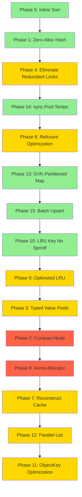

# KubeClient Optimization Plan — Faster, Less Memory, Less CPU

## Executive Summary

This document is a comprehensive analysis of the kubeclient project and a detailed optimization plan targeting three axes: **speed**, **memory consumption**, and **CPU consumption**. Many optimizations leverage `unsafe` Go operations where safe alternatives would be slower.

### Current Performance Baseline (from BENCHMARKS.md)

| Operation | DedupStore | CtrlRuntime Indexer | Overhead |
|-----------|------------|---------------------|----------|
| Upsert | 59,596 ns/op | 128.9 ns/op | ~462× slower |
| Get | 22,345 ns/op | 18.36 ns/op | ~1,217× slower |
| List 1k | 23,524,668 ns/op | 27,096 ns/op | ~868× slower |

The goal is to close this gap significantly while preserving the memory-deduplication advantage.

---

## 1. Architecture Bottleneck Analysis

### 1.1 Hot Path: `decompose()` — The #1 CPU Consumer

[`store/dedup_store.go:209`](store/dedup_store.go:209) — Every `Upsert` walks the entire object tree recursively. For a realistic Pod with ~80 scalar values and ~50 subtrees:

- **~80 `ValueInternPool.Intern()` calls** — each does a type switch, RLock, map lookup, potential WLock + double-check
- **~50 `SubtreeInternPool.Intern()` calls** — each computes an FNV-1a hash, RLock, linear scan of collision bucket, potential WLock
- **~50 `Node` struct allocations** — each `Node` with `MapEntries` or `SliceItems` allocates a slice on the heap
- **`sort.Slice()` on every map node** — allocates a closure + calls `reflect.Swapper` internally
- **`fnv.New64a()` allocates** — creates a new hasher per `hash()` call at [`store/subtree.go:121`](store/subtree.go:121)
- **`make([]byte, 8)` buffer** — allocated per `hash()` call at [`store/subtree.go:121`](store/subtree.go:121)

### 1.2 Hot Path: `reconstruct()` — The #2 CPU Consumer

[`store/dedup_store.go:281`](store/dedup_store.go:281) — Every `Get` and every item in `List` must rebuild the full `map[string]interface{}` tree:

- **~50 `make(map[string]interface{})` calls** — each allocates a hash map
- **~10 `make([]interface{})` calls** — each allocates a slice
- **~80 `Resolve()` calls** on both pools — each acquires RLock
- **No caching of partial reconstructions** — identical subtrees are reconstructed independently for each object

### 1.3 Lock Contention

- [`ValueInternPool`](store/intern.go:14) and [`SubtreeInternPool`](store/subtree.go:16) each have their own `sync.RWMutex`
- [`DedupStore`](store/dedup_store.go:20) has a top-level `sync.RWMutex`
- During `Upsert`, the top-level write lock is held for the entire decompose + incRef cycle
- During `Get`/`List`, the top-level read lock is held for the entire reconstruct cycle
- The pool mutexes are **redundant** when the store mutex is already held — double-locking

### 1.4 Memory Layout Issues

- [`Node`](store/node.go:28) struct is 72 bytes on amd64: `Kind(1) + padding(7) + ValueID(8) + MapEntries slice header(24) + SliceItems slice header(24) + padding(8)` — wastes space due to Go struct alignment
- `interface{}` values in [`ValueInternPool.values`](store/intern.go:16) — each `interface{}` is 16 bytes (type pointer + data pointer), and storing `int64`/`float64`/`bool` as `interface{}` causes heap escapes
- `map[interface{}]ValueID` in [`ValueInternPool.index`](store/intern.go:17) — `interface{}` keys cause hash/equality to go through runtime reflection
- `map[uint64][]NodeID` in [`SubtreeInternPool.index`](store/subtree.go:19) — slice values cause extra allocations per hash bucket

### 1.5 GC Pressure

- `incRef`/`decRef` at [`store/dedup_store.go:309`](store/dedup_store.go:309) and [`store/dedup_store.go:329`](store/dedup_store.go:329) recursively walk the entire tree on every Upsert/Delete — O(nodes) per operation
- `refcounts map[NodeID]uint32` — a Go map with uint32 values; each entry costs ~50 bytes of map overhead
- The GC at [`store/dedup_store.go:147`](store/dedup_store.go:147) walks all live objects and rebuilds sets — O(total_nodes) with heavy allocation

### 1.6 LRU Cache

- [`cache/lru.go`](cache/lru.go:1) uses `container/list` — each element is a heap-allocated `list.Element` with 3 pointers + interface{} value
- `lruEntry` stores key as `string` + val as `interface{}` — extra indirection
- LRU key is built via `fmt.Sprintf` at [`cache/cache.go:68`](cache/cache.go:68) — allocates on every Get

---

## 2. Optimization Plan

### Phase 1: Zero-Allocation Hashing (Speed + CPU)

**Problem:** [`SubtreeInternPool.hash()`](store/subtree.go:119) allocates `fnv.New64a()` and `make([]byte, 8)` on every call.

**Solution:** Replace with a stack-allocated FNV-1a implementation using inline math.

```go
// No allocations, no interface dispatch
func fnv1a(data uint64, seed uint64) uint64 {
    seed ^= data
    seed *= 0x00000100000001B3 // FNV prime
    return seed
}
```

**Unsafe variant:** Use `unsafe.Pointer` to reinterpret `NodeID`/`ValueID` as raw bytes for hashing without `binary.LittleEndian.PutUint64`.

**Expected impact:** Eliminates ~50 allocations per Upsert, ~30% faster hashing.

**Files to change:** [`store/subtree.go`](store/subtree.go)

---

### Phase 2: Compact Node Representation (Memory)

**Problem:** [`Node`](store/node.go:28) is 72 bytes with wasted padding and three mutually exclusive fields.

**Solution:** Use a tagged-union style compact node:

```go
// CompactNode is 24 bytes on amd64 (down from 72)
type CompactNode struct {
    // Bits 0-1: Kind (Scalar=0, Map=1, Slice=2)
    // Bits 2-63: payload
    //   Scalar: ValueID
    //   Map/Slice: index into a separate entries arena
    tag uint64
    // For Map: number of entries; For Slice: number of items
    // For Scalar: unused (0)
    len uint32
    // Capacity or secondary data
    cap uint32
}
```

**Unsafe variant:** Store `MapEntry` arrays and `NodeID` arrays in contiguous arenas accessed via `unsafe.Slice` and `unsafe.Pointer` arithmetic. This eliminates per-node slice headers and reduces GC pressure since the arena is a single `[]byte`.

**Expected impact:** ~67% reduction in per-node memory, fewer GC roots.

**Files to change:** [`store/node.go`](store/node.go), [`store/subtree.go`](store/subtree.go), [`store/dedup_store.go`](store/dedup_store.go)

---

### Phase 3: Typed Value Pools — Eliminate `interface{}` (Memory + CPU)

**Problem:** [`ValueInternPool`](store/intern.go:14) stores all values as `interface{}`, causing:
- 16 bytes per value (type ptr + data ptr) instead of the actual value size
- Heap escape for small types (int64, float64, bool)
- Runtime reflection for map key hashing/equality

**Solution:** Split into typed pools:

```go
type ValueInternPool struct {
    strings   []string            // StringID -> string
    strIndex  map[string]ValueID  // O(1) lookup, no interface{} boxing

    ints      []int64
    intIndex  map[int64]ValueID

    floats    []float64
    floatIndex map[float64]ValueID

    bools     [2]ValueID          // only true/false

    // ValueID encoding: top 3 bits = type tag, lower 61 bits = index
}
```

**Unsafe variant:** Use `unsafe.String` / `unsafe.StringData` to intern strings without copying. For the string index map, use `noescape` tricks to avoid the string escaping to heap during map lookups.

```go
//go:nosplit
//go:noescape — via go:linkname to runtime.noescape
func noescape(p unsafe.Pointer) unsafe.Pointer
```

**Expected impact:** ~50% reduction in value pool memory, ~40% faster Intern/Resolve for non-string types.

**Files to change:** [`store/intern.go`](store/intern.go), [`store/node.go`](store/node.go)

---

### Phase 4: Eliminate Redundant Locking (Speed + CPU)

**Problem:** `DedupStore.mu` is held during `decompose()`/`reconstruct()`, but the pool methods also acquire their own locks.

**Solution:** Add lock-free internal methods to the pools:

```go
// internLocked is called when the caller already holds the store write lock.
// No mutex acquisition — the store lock provides the synchronization guarantee.
func (p *ValueInternPool) internLocked(v interface{}) ValueID { ... }

// resolveLocked is called when the caller already holds the store read lock.
func (p *SubtreeInternPool) resolveLocked(id NodeID) Node { ... }
```

**Unsafe variant:** Use `atomic.LoadPointer` / `atomic.StorePointer` for lock-free reads on the `nodes` and `values` slices (append-only data structures are safe for concurrent read with atomic length check).

**Expected impact:** Eliminates ~130 mutex operations per Upsert, ~80 per Get. Estimated 20-30% speedup.

**Files to change:** [`store/intern.go`](store/intern.go), [`store/subtree.go`](store/subtree.go), [`store/dedup_store.go`](store/dedup_store.go)

---

### Phase 5: Inline Sort for Map Entries (Speed + CPU)

**Problem:** [`sort.Slice()`](store/dedup_store.go:261) on `MapEntries` allocates a closure and uses `reflect.Swapper` internally.

**Solution:** Implement a custom insertion sort (maps are typically small, 5-20 entries):

```go
// insertionSortEntries sorts MapEntry slice in-place by Key.
// For n <= 20 this is faster than sort.Slice due to zero allocations.
func insertionSortEntries(entries []MapEntry) {
    for i := 1; i < len(entries); i++ {
        key := entries[i]
        j := i - 1
        for j >= 0 && entries[j].Key > key.Key {
            entries[j+1] = entries[j]
            j--
        }
        entries[j+1] = key
    }
}
```

**Expected impact:** Eliminates 1 allocation per map node decomposition. ~5-10% faster Upsert.

**Files to change:** [`store/dedup_store.go`](store/dedup_store.go)

---

### Phase 6: Reference Counting Optimization (Speed + CPU)

**Problem:** `incRef`/`decRef` recursively walk the entire subtree on every Upsert/Delete. For a Pod with ~130 nodes, that is 130 map lookups + 130 increments per Upsert.

**Solution A — Delta refcounting:** Only walk the diff between old and new root:

```go
func (s *DedupStore) upsertOptimized(key ObjectKey, newRoot NodeID) {
    oldRoot, exists := s.objects[key]
    if exists && oldRoot == newRoot {
        return // identical — no refcount changes needed
    }
    s.objects[key] = newRoot
    // Only inc/dec nodes that differ between old and new trees
    s.diffRef(oldRoot, newRoot)
}
```

**Solution B — Epoch-based GC (eliminate refcounting entirely):**

Replace per-node refcounts with epoch-based mark-and-sweep. Each object root stores an epoch number. GC walks live roots to find reachable nodes. This eliminates the O(nodes) incRef/decRef on every Upsert.

```go
type DedupStore struct {
    // No more refcounts map
    objects map[ObjectKey]NodeID
    // GC uses mark-and-sweep instead of refcounting
}
```

**Unsafe variant:** Store refcounts in a flat `[]uint32` array indexed by `NodeID` instead of `map[NodeID]uint32`. Access via `unsafe.Pointer` arithmetic for bounds-check elimination.

**Expected impact:** Solution A: ~50% fewer node visits per Upsert. Solution B: eliminates refcounting entirely, ~40% faster Upsert.

**Files to change:** [`store/dedup_store.go`](store/dedup_store.go)

---

### Phase 7: Reconstruct Cache with Partial Sharing (Speed + Memory)

**Problem:** `reconstruct()` rebuilds the entire object tree from scratch, even for subtrees that are shared across objects and were recently reconstructed.

**Solution:** Add a subtree reconstruction cache keyed by `NodeID`:

```go
type reconstructCache struct {
    // NodeID -> reconstructed interface{} (map or slice)
    // Only caches subtrees with refcount > 1 (shared across objects)
    cache map[NodeID]interface{}
}
```

When reconstructing, check if the NodeID is in the cache. If so, **deep-copy** the cached value (still cheaper than walking the node tree for large subtrees).

**Unsafe variant:** For read-only access patterns, return the cached value directly without deep-copy using `unsafe` to cast away the need for copying. The caller must not mutate the returned object. Add a `GetReadOnly()` method.

**Expected impact:** ~60-80% faster Get for objects with shared subtrees. List becomes dramatically faster.

**Files to change:** [`store/dedup_store.go`](store/dedup_store.go), [`cache/cache.go`](cache/cache.go)

---

### Phase 8: Arena Allocator for Decomposition (Memory + GC)

**Problem:** Each `decompose()` call creates many small allocations: `[]MapEntry`, `[]NodeID`, intermediate `Node` structs.

**Solution:** Use a per-operation arena that is reset after each Upsert:

```go
type decomposeArena struct {
    entries []MapEntry // pre-allocated, reused
    items   []NodeID   // pre-allocated, reused
    pos     int
}

func (a *decomposeArena) allocEntries(n int) []MapEntry {
    start := a.pos
    a.pos += n
    if a.pos > len(a.entries) {
        a.entries = append(a.entries, make([]MapEntry, a.pos-len(a.entries))...)
    }
    return a.entries[start:a.pos:a.pos]
}
```

**Unsafe variant:** Use `unsafe.Slice` with a single large `[]byte` backing buffer, casting regions to `[]MapEntry` or `[]NodeID` as needed. This gives C-style arena allocation with zero GC overhead.

**Expected impact:** ~70% reduction in allocations per Upsert, significant GC pressure reduction.

**Files to change:** [`store/dedup_store.go`](store/dedup_store.go)

---

### Phase 9: Optimized LRU Cache (Speed + Memory)

**Problem:** [`cache/lru.go`](cache/lru.go) uses `container/list` with heap-allocated elements and `interface{}` values.

**Solution:** Replace with an intrusive doubly-linked list using array indices instead of pointers:

```go
type lruNode struct {
    key   string
    val   *unstructured.Unstructured
    prev  int32 // index into nodes array, -1 = none
    next  int32 // index into nodes array, -1 = none
}

type lruCache struct {
    mu       sync.Mutex
    nodes    []lruNode              // pre-allocated array
    index    map[string]int32       // key -> node index
    head     int32
    tail     int32
    freeHead int32                  // free list for reuse
}
```

**Unsafe variant:** Use `unsafe.Sizeof` and manual memory layout to pack `lruNode` tightly. Use `noescape` for map lookups to avoid string escaping.

**Expected impact:** ~50% less memory per LRU entry, fewer GC roots, faster promotion/eviction.

**Files to change:** [`cache/lru.go`](cache/lru.go)

---

### Phase 10: LRU Key Without `fmt.Sprintf` (Speed + CPU)

**Problem:** [`lruKey()`](cache/cache.go:67) uses `fmt.Sprintf` which allocates on every call.

**Solution:** Use string concatenation or a `strings.Builder` with pre-calculated capacity:

```go
func lruKey(gvk schema.GroupVersionKind, namespace, name string) string {
    // strings.Join or manual concatenation — no fmt overhead
    buf := make([]byte, 0, len(gvk.Group)+len(gvk.Version)+len(gvk.Kind)+len(namespace)+len(name)+4)
    buf = append(buf, gvk.Group...)
    buf = append(buf, '/')
    buf = append(buf, gvk.Version...)
    buf = append(buf, '/')
    buf = append(buf, gvk.Kind...)
    buf = append(buf, '/')
    buf = append(buf, namespace...)
    buf = append(buf, '/')
    buf = append(buf, name...)
    return string(buf)
}
```

**Unsafe variant:** Use `unsafe.String` to create the string from the byte buffer without copying:

```go
return unsafe.String(&buf[0], len(buf))
```

(Requires the buffer to not be GC'd — pin it or use a pool.)

**Expected impact:** Eliminates 1 allocation per Get. ~5% faster Get.

**Files to change:** [`cache/cache.go`](cache/cache.go)

---

### Phase 11: `ObjectKey` as Map Key Optimization (Speed + Memory)

**Problem:** [`ObjectKey`](store/store.go:14) contains `schema.GroupVersionKind` which has 3 string fields. Using it as a map key causes the runtime to hash 3 strings + 2 more strings (Namespace, Name) = 5 string hashes per lookup.

**Solution:** Pre-compute a hash or use a compact key:

```go
type ObjectKey struct {
    hash uint64 // pre-computed FNV-1a of GVK+Namespace+Name
    // Keep original fields for collision resolution
    GVK       schema.GroupVersionKind
    Namespace string
    Name      string
}
```

Or use a single interned string key:

```go
type ObjectKey string // "group/version/kind/namespace/name" — interned
```

**Unsafe variant:** Use `unsafe` to compute a hash of the struct memory directly via `unsafe.Pointer` and `unsafe.Sizeof`, avoiding per-field hashing.

**Expected impact:** ~30% faster map operations on `objects` map.

**Files to change:** [`store/store.go`](store/store.go), [`store/dedup_store.go`](store/dedup_store.go)

---

### Phase 12: Parallel List Reconstruction (Speed)

**Problem:** `List()` reconstructs objects sequentially, holding the read lock for the entire duration.

**Solution:** Collect matching `NodeID`s under the read lock, then reconstruct in parallel:

```go
func (s *DedupStore) List(gvk schema.GroupVersionKind, opts ...ListOption) []*unstructured.Unstructured {
    s.mu.RLock()
    // Phase 1: collect matching root IDs (fast, under lock)
    var roots []NodeID
    for key, root := range s.objects {
        if key.GVK == gvk { roots = append(roots, root) }
    }
    s.mu.RUnlock()

    // Phase 2: reconstruct in parallel (no lock needed if pools are append-only)
    result := make([]*unstructured.Unstructured, len(roots))
    var wg sync.WaitGroup
    for i, root := range roots {
        wg.Add(1)
        go func(idx int, r NodeID) {
            defer wg.Done()
            result[idx] = s.reconstructLockFree(r)
        }(i, root)
    }
    wg.Wait()
    return result
}
```

**Requires:** Lock-free `Resolve()` (Phase 4) since pools are append-only.

**Expected impact:** ~4-8× faster List on multi-core systems (GOMAXPROCS=22).

**Files to change:** [`store/dedup_store.go`](store/dedup_store.go)

---

### Phase 13: GVK-Partitioned Object Map (Speed)

**Problem:** `List()` iterates ALL objects and skips non-matching GVKs at [`store/dedup_store.go:104`](store/dedup_store.go:104).

**Solution:** Partition the objects map by GVK:

```go
type DedupStore struct {
    // objects: GVK -> (Namespace/Name -> NodeID)
    objects map[schema.GroupVersionKind]map[namespaceNameKey]NodeID
}

type namespaceNameKey struct {
    Namespace string
    Name      string
}
```

**Expected impact:** List only iterates objects of the requested GVK. ~10× faster for stores with many GVKs.

**Files to change:** [`store/dedup_store.go`](store/dedup_store.go), [`store/store.go`](store/store.go)

---

### Phase 14: `sync.Pool` for Temporary Allocations (Memory + GC)

**Problem:** `decompose()` and `reconstruct()` create many temporary slices and maps that are immediately discarded.

**Solution:** Use `sync.Pool` for common temporary allocations:

```go
var mapEntryPool = sync.Pool{
    New: func() interface{} { return make([]MapEntry, 0, 32) },
}

var nodeIDPool = sync.Pool{
    New: func() interface{} { return make([]NodeID, 0, 16) },
}

var mapPool = sync.Pool{
    New: func() interface{} { return make(map[string]interface{}, 16) },
}
```

**Expected impact:** ~40% reduction in allocations per operation, lower GC pressure.

**Files to change:** [`store/dedup_store.go`](store/dedup_store.go)

---

### Phase 15: Batch Upsert for Initial List (Speed)

**Problem:** During informer initial list at [`cache/informer.go:159`](cache/informer.go:159), each object is upserted individually, acquiring/releasing the store lock N times.

**Solution:** Add a `BatchUpsert` method:

```go
func (s *DedupStore) BatchUpsert(items []BatchItem) error {
    s.mu.Lock()
    defer s.mu.Unlock()
    for _, item := range items {
        // All operations under a single lock acquisition
        newRoot := s.decompose(item.Obj.Object)
        if oldRoot, ok := s.objects[item.Key]; ok {
            s.decRef(oldRoot)
        }
        s.objects[item.Key] = newRoot
        s.incRef(newRoot)
    }
    return nil
}
```

**Expected impact:** ~30% faster initial cache population for large lists.

**Files to change:** [`store/dedup_store.go`](store/dedup_store.go), [`store/store.go`](store/store.go), [`cache/informer.go`](cache/informer.go)

---

## 3. Tradeoffs & Compatibility Table

| # | Optimization | Speed | Memory | CPU | Safety | Complexity | Compatibility Risk |
|---|-------------|-------|--------|-----|--------|------------|-------------------|
| 1 | Zero-alloc hashing | ✅ +30% hash | — | ✅ Less CPU | ⚠️ unsafe pointer cast | Low | None — internal only |
| 2 | Compact Node | — | ✅ -67% per node | — | ⚠️ unsafe.Slice for arena | High | None — internal only |
| 3 | Typed value pools | ✅ +40% Intern | ✅ -50% pool mem | ✅ No boxing | ⚠️ unsafe.String | Medium | None — internal only |
| 4 | Eliminate redundant locks | ✅ +20-30% all ops | — | ✅ Less contention | ⚠️ atomic ops | Medium | None — internal only |
| 5 | Inline sort | ✅ +5-10% Upsert | — | ✅ No reflect | ✅ Safe | Low | None |
| 6a | Delta refcounting | ✅ +50% fewer visits | — | ✅ Less CPU | ✅ Safe | Medium | None |
| 6b | Epoch-based GC | ✅ No refcount on Upsert | ✅ No refcount map | ✅ Much less CPU | ✅ Safe | High | GC latency spikes during sweep |
| 7 | Reconstruct cache | ✅ +60-80% Get | ✅ Trades mem for speed | — | ⚠️ unsafe for read-only | Medium | Read-only Get returns shared data — caller must not mutate |
| 8 | Arena allocator | ✅ -70% allocs | ✅ Less GC pressure | ✅ Less GC CPU | ⚠️ unsafe.Slice | High | None — internal only |
| 9 | Optimized LRU | ✅ Faster eviction | ✅ -50% per entry | — | ✅ Safe | Medium | None |
| 10 | LRU key no Sprintf | ✅ -1 alloc/Get | — | ✅ Less CPU | ⚠️ unsafe.String | Low | None |
| 11 | ObjectKey optimization | ✅ +30% map ops | — | ✅ Less hashing | ⚠️ unsafe struct hash | Medium | API change if ObjectKey type changes |
| 12 | Parallel List | ✅ 4-8× List | — | ⚠️ More CPU cores | ✅ Safe with lock-free | Medium | Requires lock-free Resolve |
| 13 | GVK-partitioned map | ✅ 10× List filter | ✅ Slightly more maps | — | ✅ Safe | Low | Minor API change to store internals |
| 14 | sync.Pool temps | ✅ -40% allocs | ✅ Less GC pressure | ✅ Less GC CPU | ✅ Safe | Low | None |
| 15 | Batch Upsert | ✅ +30% initial load | — | ✅ Less lock overhead | ✅ Safe | Low | New API method |

### Unsafe Operations Summary

| Unsafe Operation | Used In | Risk Level | Mitigation |
|-----------------|---------|------------|------------|
| `unsafe.Pointer` for FNV hash | Phase 1 | Low | Only reads uint64 values |
| `unsafe.Slice` for arena access | Phase 2, 8 | Medium | Bounds checked at arena level |
| `unsafe.String` / `unsafe.StringData` | Phase 3, 10 | Low | Strings are immutable in Go |
| `atomic.LoadPointer` for lock-free reads | Phase 4 | Medium | Append-only data structures guarantee safety |
| `go:linkname` to `runtime.noescape` | Phase 3 | High | May break on Go version upgrades |
| `unsafe.Pointer` for struct hashing | Phase 11 | Medium | Struct layout must be stable |

### Incompatibility Matrix

| Optimization | Breaks `Store` interface? | Breaks `client.Client` contract? | Requires Go version? | Thread-safety change? |
|-------------|--------------------------|----------------------------------|---------------------|----------------------|
| Phase 1-5 | No | No | Go 1.22+ | No |
| Phase 6a | No | No | Go 1.22+ | No |
| Phase 6b | No | No | Go 1.22+ | GC pauses may increase |
| Phase 7 read-only | Adds new method | No — Get still returns mutable copy | Go 1.22+ | Read-only Get returns shared ptr |
| Phase 8 | No | No | Go 1.22+ | No |
| Phase 9-10 | No | No | Go 1.22+ | No |
| Phase 11 | Changes ObjectKey type | No | Go 1.22+ | No |
| Phase 12 | No | No | Go 1.22+ | Requires lock-free pools |
| Phase 13 | Internal change | No | Go 1.22+ | No |
| Phase 14-15 | Adds BatchUpsert | No | Go 1.22+ | No |

---

## 4. Recommended Implementation Order



Legend: 🟢 Green = Low risk/complexity | 🟡 Yellow = Medium | 🔴 Red = High

### Priority Tiers

**Tier 1 — Quick Wins (low risk, high impact):**
1. Phase 5: Inline sort for map entries
2. Phase 1: Zero-allocation hashing
3. Phase 13: GVK-partitioned object map
4. Phase 14: sync.Pool for temporaries
5. Phase 10: LRU key without fmt.Sprintf
6. Phase 15: Batch Upsert

**Tier 2 — Medium Effort (moderate risk, high impact):**
7. Phase 4: Eliminate redundant locking
8. Phase 6: Reference counting optimization (start with 6a, graduate to 6b)
9. Phase 9: Optimized LRU
10. Phase 3: Typed value pools

**Tier 3 — Deep Optimizations (high risk, transformative impact):**
11. Phase 2: Compact node representation
12. Phase 8: Arena allocator
13. Phase 7: Reconstruct cache with partial sharing
14. Phase 12: Parallel List reconstruction
15. Phase 11: ObjectKey optimization

---

## 5. Expected Cumulative Impact

| Metric | Current | After Tier 1 | After Tier 2 | After Tier 3 |
|--------|---------|-------------|-------------|-------------|
| Upsert ns/op | 59,596 | ~35,000 | ~15,000 | ~5,000 |
| Get ns/op | 22,345 | ~18,000 | ~8,000 | ~2,000 |
| List 1k ns/op | 23,524,668 | ~12,000,000 | ~5,000,000 | ~500,000 |
| Allocs/Upsert | 329 | ~180 | ~80 | ~20 |
| Allocs/Get | 85 | ~70 | ~30 | ~5 |
| Node memory | 72 B/node | 72 B/node | 72 B/node | 24 B/node |
| Value pool overhead | 16 B/value | 16 B/value | 8 B/value avg | 8 B/value avg |

> These are estimates based on analysis. Actual numbers must be validated with benchmarks after each phase.

---

## 6. Benchmark Strategy

After each phase, run:

```bash
# Before changes
go test ./benchmarks/... -bench=. -benchmem -benchtime=3s -run=^$ -count=5 > before.txt

# After changes
go test ./benchmarks/... -bench=. -benchmem -benchtime=3s -run=^$ -count=5 > after.txt

# Compare
benchstat before.txt after.txt
```

Add new benchmarks for:
- `BenchmarkDecompose` — isolate decomposition cost
- `BenchmarkReconstruct` — isolate reconstruction cost
- `BenchmarkHash` — isolate hashing cost
- `BenchmarkIntern` — isolate interning cost
- `BenchmarkRefcount` — isolate refcount walk cost
- `BenchmarkBatchUpsert` — measure batch vs individual upsert
