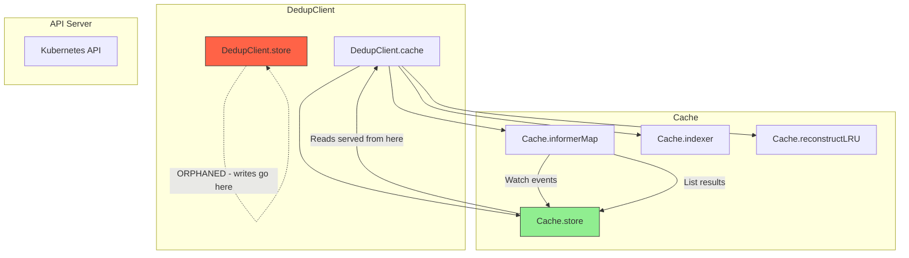
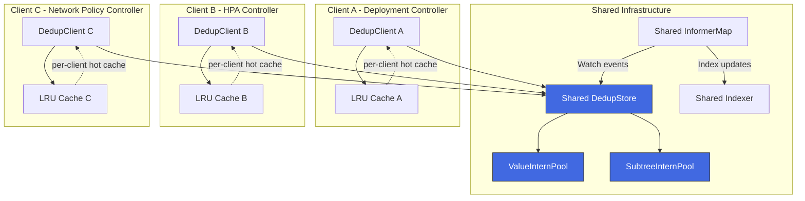
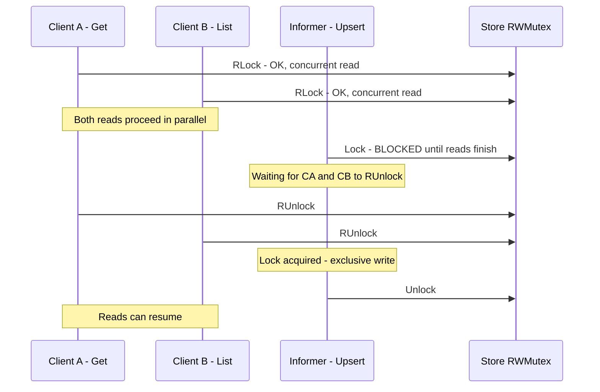
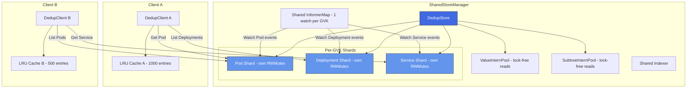

# Shared Storage Architecture — Multiple Clients, One DedupStore

## 1. Critical Finding: The Dual-Store Bug

Before analyzing shared storage, there is a **critical architectural bug** in the current codebase that must be understood and fixed first.

### Current Wiring



### The Problem

In [`client.go:42-83`](client.go:42), the `New()` constructor creates **two independent DedupStores**:

1. **`client.go:69`** — `s := store.NewDedupStore()` → assigned to `DedupClient.store`
2. **`cache/cache.go:47`** — `s := store.NewDedupStore()` → assigned to `Cache.store` (inside `NewCache()`)

The data flows are disconnected:

| Operation | Target Store | Read From |
|-----------|-------------|-----------|
| [`DedupClient.Get()`](client.go:88) | — | `Cache.store` ✅ |
| [`DedupClient.List()`](client.go:93) | — | `Cache.store` ✅ |
| [`DedupClient.Create()`](client.go:100) | `DedupClient.store` ❌ | — |
| [`DedupClient.Update()`](client.go:153) | `DedupClient.store` ❌ | — |
| [`DedupClient.Delete()`](client.go:238) | `DedupClient.store` ❌ | — |
| [`DedupClient.Patch()`](client.go:194) | `DedupClient.store` ❌ | — |
| [`SubResource.Update()`](client.go:472) | `DedupClient.store` ❌ | — |
| [`SubResource.Patch()`](client.go:534) | `DedupClient.store` ❌ | — |
| Informer watch events | `Cache.store` ✅ | — |
| Informer initial list | `Cache.store` ✅ | — |

**Consequence:** Write-through cache updates from `Create`/`Update`/`Delete`/`Patch` go to `DedupClient.store`, which is **never read by anyone**. The cache only sees updates when the informer watch event arrives from the API server. This means:

- The write-through optimization described in the design doc is **not working**
- There is a stale-read window between the API write and the informer event
- `DedupClient.store` accumulates objects that are never GC'd, leaking memory
- The `DedupClient.store` consumes memory for decomposition/interning that provides zero benefit

### Fix Required Before Shared Storage

The `DedupClient.store` field should be removed. Write-through updates should go directly to `Cache.store`. This is a prerequisite for any shared storage design.

```go
// Fixed New() — no separate store
func New(cfg *rest.Config, optFns ...Option) (*DedupClient, error) {
    // ...
    cacheInstance := cache.NewCache(dynClient, opts.scheme, opts.namespaces, opts.reconstructLRUSize)
    
    return &DedupClient{
        dynamic: dynClient,
        cache:   cacheInstance,
        codec:   c,
        // store field removed — use cache.Store() instead
        scheme:  opts.scheme,
        mapper:  mapper,
        opts:    opts,
    }, nil
}
```

---

## 2. Shared Storage Model: Multiple Clients, One Store

### 2.1 Use Case

In large Kubernetes operators, it is common to have multiple controllers or reconcilers that all need to read the same set of objects. For example:

- A **Deployment controller** reads Pods, ReplicaSets, Deployments
- A **HPA controller** reads Pods, Deployments, HPAs
- A **Network policy controller** reads Pods, Services, NetworkPolicies

All three share Pods and Deployments. With independent clients, each maintains its own DedupStore with its own intern pools — tripling the memory for shared GVKs.

### 2.2 Architecture: Shared Store



### 2.3 What Is Shared vs Per-Client

| Component | Shared? | Rationale |
|-----------|---------|-----------|
| `DedupStore` | ✅ Shared | Single source of truth for all objects |
| `ValueInternPool` | ✅ Shared (inside store) | Maximum deduplication across all clients |
| `SubtreeInternPool` | ✅ Shared (inside store) | Maximum subtree sharing |
| `InformerMap` | ✅ Shared | One watch per GVK, not N watches |
| `Indexer` | ✅ Shared | Index data is the same for all clients |
| `LRU Cache` | ❌ Per-client | Different access patterns per controller |
| `Codec` | ❌ Per-client | May use different schemes |
| `dynamic.Interface` | ✅ Shared | Single HTTP/2 connection pool |
| `RESTMapper` | ✅ Shared | Same cluster, same API discovery |

---

## 3. Performance Impact Analysis

### 3.1 Memory Impact

#### Current: N Independent Clients

With N clients each watching the same set of GVKs:

```
Total Memory = N × (DedupStore overhead + ValueInternPool + SubtreeInternPool + objects map)
```

For 3 clients watching 10,000 Pods:

| Component | Per Client | 3 Clients (Independent) |
|-----------|-----------|------------------------|
| ValueInternPool (~200 unique values) | ~6.4 KB | ~19.2 KB |
| SubtreeInternPool (~500 unique nodes) | ~36 KB | ~108 KB |
| Objects map (10k entries) | ~480 KB | ~1,440 KB |
| Refcounts map (10k entries) | ~480 KB | ~1,440 KB |
| Intern index maps | ~32 KB | ~96 KB |
| **Total store overhead** | **~1,034 KB** | **~3,103 KB** |

> Note: The intern pools themselves are small because deduplication works. The dominant cost is the `objects` map and `refcounts` map which scale with object count, not unique content.

#### Shared: 1 Store, N Clients

```
Total Memory = 1 × (DedupStore overhead) + N × (LRU cache)
```

| Component | Shared Store | 3 Clients (Shared) |
|-----------|-------------|-------------------|
| ValueInternPool | ~6.4 KB | ~6.4 KB |
| SubtreeInternPool | ~36 KB | ~36 KB |
| Objects map | ~480 KB | ~480 KB |
| Refcounts map | ~480 KB | ~480 KB |
| Intern index maps | ~32 KB | ~32 KB |
| Per-client LRU (1000 entries each) | — | ~240 KB |
| **Total** | **~1,034 KB** | **~1,274 KB** |

**Memory savings: ~59% (3,103 KB → 1,274 KB) for 3 clients**

The savings scale linearly with client count:

| Clients | Independent | Shared | Savings |
|---------|------------|--------|---------|
| 1 | 1,034 KB | 1,114 KB | -8% (overhead of LRU) |
| 2 | 2,069 KB | 1,194 KB | 42% |
| 3 | 3,103 KB | 1,274 KB | 59% |
| 5 | 5,172 KB | 1,434 KB | 72% |
| 10 | 10,344 KB | 1,834 KB | 82% |

### 3.2 CPU Impact

#### Informer Watch Events

| Metric | Independent (N clients) | Shared (1 store) |
|--------|------------------------|-------------------|
| API server watches | N per GVK | 1 per GVK |
| Network bandwidth | N × event size | 1 × event size |
| `decompose()` calls per event | N | 1 |
| `incRef()`/`decRef()` calls per event | N | 1 |
| Index updates per event | N | 1 |

**CPU savings on watch events: ~(N-1)/N** — for 3 clients, ~67% less CPU on the watch path.

This is significant because `decompose()` is the most expensive operation (59,596 ns/op). With 3 independent clients, every watch event triggers 3 decompositions. With shared storage, it triggers 1.

#### Read Path (Get/List)

| Metric | Independent | Shared |
|--------|------------|--------|
| `reconstruct()` per Get | 1 (from client's own store) | 1 (from shared store) |
| Lock contention on Get | Low (own mutex) | Higher (shared mutex) |
| LRU hit rate | Lower (per-client cache) | Same (per-client LRU) |

**Read performance is approximately the same** for a single Get. However, lock contention increases under concurrent access from multiple clients.

#### Write Path (Create/Update/Delete)

| Metric | Independent | Shared |
|--------|------------|--------|
| `decompose()` per write | 1 | 1 |
| Lock contention on write | Low (own mutex) | Higher (shared mutex) |
| Write-through latency | Same | Same |

**Write performance is approximately the same** for a single write, but contention increases.

### 3.3 Lock Contention Analysis

This is the **primary tradeoff** of shared storage.

#### Contention Model

The `DedupStore` uses a single `sync.RWMutex`. With N clients:

- **Reads** (Get/List) acquire `RLock` — multiple readers can proceed concurrently
- **Writes** (Upsert from informer or write-through) acquire `Lock` — exclusive, blocks all readers



#### Contention Scenarios

**Scenario 1: Read-heavy (typical controller pattern)**

Most controllers spend 99% of time reading (reconcile loops) and 1% writing (watch events). With `sync.RWMutex`, multiple readers proceed concurrently. Contention is minimal.

| Metric | Independent | Shared |
|--------|------------|--------|
| Read-read contention | None | None (RWMutex allows concurrent reads) |
| Read-write contention | Rare | Slightly more frequent (N clients reading while 1 informer writes) |
| Write-write contention | None (1 informer per GVK) | None (still 1 informer per GVK) |

**Impact: Negligible for read-heavy workloads.**

**Scenario 2: Write-heavy (high-frequency status updates)**

If the cluster has high churn (many pods starting/stopping), the informer generates frequent Upsert calls. Each Upsert holds the write lock for the duration of `decompose()` (~60μs). During this time, all reads from all clients are blocked.

| Metric | Value |
|--------|-------|
| Upsert duration (write lock held) | ~60 μs |
| Events per second (busy cluster) | ~100-1000 |
| Write lock time per second | 6-60 ms |
| Read stall probability | 0.6% - 6% |

For 1000 events/sec, reads are blocked ~6% of the time. This is noticeable but not catastrophic.

**Impact: Moderate for write-heavy workloads. Mitigated by LRU cache (reads that hit LRU don't touch the store).**

**Scenario 3: List-heavy (large result sets)**

`List()` holds the read lock for the entire reconstruction of all matching objects. For 1000 objects at ~23ms per List, the read lock is held for 23ms. During this time, no writes can proceed.

| Metric | Independent | Shared |
|--------|------------|--------|
| List lock duration | 23 ms | 23 ms |
| Write starvation during List | Only own informer blocked | All informers blocked |
| Concurrent Lists | Each on own lock | All share one lock |

**Impact: Significant if multiple clients call List concurrently. Informer events queue up during long Lists.**

### 3.4 Informer Deduplication

The biggest win of shared storage is **informer deduplication**. With independent clients:

```
N clients × M GVKs = N×M watches against the API server
```

With shared storage:

```
M GVKs = M watches against the API server
```

Each watch consumes:
- 1 HTTP/2 stream to the API server
- CPU for JSON decoding of each event
- Memory for the event buffer

For a cluster with 10 GVKs and 5 clients:
- Independent: 50 watches
- Shared: 10 watches
- **80% reduction in API server load**

This is often the most impactful benefit, especially in large clusters where API server load is a bottleneck.

---

## 4. Design: SharedStoreManager

### 4.1 API Design

```go
// SharedStoreManager manages a single DedupStore shared across multiple clients.
type SharedStoreManager struct {
    store       *store.DedupStore
    informerMap *cache.InformerMap
    indexer     *cache.Indexer
    dynamic     dynamic.Interface
    scheme      *runtime.Scheme
    
    mu      sync.RWMutex
    clients []*DedupClient // registered clients for LRU invalidation
}

// NewSharedStoreManager creates a shared store manager.
func NewSharedStoreManager(cfg *rest.Config, scheme *runtime.Scheme) (*SharedStoreManager, error) {
    // Single dynamic client, single store, single informer map
}

// NewClient creates a new DedupClient backed by the shared store.
// Each client gets its own LRU cache but shares the underlying store.
func (m *SharedStoreManager) NewClient(opts ...ClientOption) *DedupClient {
    // Client reads from shared store, writes through to API + shared store
}

// Start starts all informers. Call once for the entire manager.
func (m *SharedStoreManager) Start(ctx context.Context) error

// WaitForCacheSync waits for all informers to sync.
func (m *SharedStoreManager) WaitForCacheSync(ctx context.Context) bool
```

### 4.2 Usage Example

```go
// Create shared manager once
mgr, err := kubeclient.NewSharedStoreManager(cfg, scheme)

// Create per-controller clients
deployClient := mgr.NewClient(kubeclient.WithReconstructionCache(1000))
hpaClient := mgr.NewClient(kubeclient.WithReconstructionCache(500))
netpolClient := mgr.NewClient(kubeclient.WithReconstructionCache(200))

// Start once — all informers shared
go mgr.Start(ctx)
mgr.WaitForCacheSync(ctx)

// Each client reads/writes independently but shares the store
deployClient.Get(ctx, key, &deployment)
hpaClient.List(ctx, &podList)
```

### 4.3 LRU Invalidation

When the shared store receives a watch event (Upsert/Delete), all per-client LRU caches must be invalidated for that key:

```go
func (m *SharedStoreManager) onWatchEvent(key store.ObjectKey) {
    m.mu.RLock()
    defer m.mu.RUnlock()
    for _, client := range m.clients {
        client.invalidateLRU(key.GVK, key.Namespace, key.Name)
    }
}
```

This adds O(N) work per watch event where N is the number of clients. For typical N (2-10), this is negligible.

---

## 5. Performance Comparison Table

### 5.1 Memory

| Scenario | Independent (3 clients) | Shared (3 clients) | Delta |
|----------|------------------------|--------------------|----|
| 1,000 Pods | ~3.1 MB store | ~1.3 MB store | **-59%** |
| 10,000 Pods | ~31 MB store | ~11 MB store | **-65%** |
| 10,000 Pods + 5,000 Deployments | ~46 MB store | ~16 MB store | **-65%** |
| API server watches (10 GVKs) | 30 streams | 10 streams | **-67%** |
| Informer event buffers | 30 buffers | 10 buffers | **-67%** |

### 5.2 Throughput (per operation)

| Operation | Independent | Shared | Delta |
|-----------|------------|--------|-------|
| Get (LRU hit) | ~50 ns | ~50 ns | Same |
| Get (LRU miss) | ~22 μs | ~22 μs + slight contention | ~0-5% slower |
| List 1k objects | ~23 ms | ~23 ms + slight contention | ~0-5% slower |
| Upsert (informer) | ~60 μs × N clients | ~60 μs × 1 | **~(N-1)/N faster** |
| Write-through Create | ~60 μs | ~60 μs + slight contention | ~0-5% slower |

### 5.3 CPU

| Metric | Independent (3 clients) | Shared (3 clients) | Delta |
|--------|------------------------|--------------------|----|
| decompose() per watch event | 3 calls | 1 call | **-67%** |
| incRef()/decRef() per event | 3 walks | 1 walk | **-67%** |
| JSON decode per event | 3 decodes | 1 decode | **-67%** |
| Index updates per event | 3 updates | 1 update | **-67%** |
| GC work | 3 GC runs | 1 GC run | **-67%** |
| Lock contention overhead | None | ~1-6% | Slight increase |

### 5.4 API Server Impact

| Metric | Independent (3 clients, 10 GVKs) | Shared | Delta |
|--------|----------------------------------|--------|----|
| Watch streams | 30 | 10 | **-67%** |
| List calls on reconnect | 30 | 10 | **-67%** |
| API server CPU for serialization | 3× | 1× | **-67%** |
| etcd read load from watches | 3× | 1× | **-67%** |

---

## 6. Tradeoffs & Risks

| Tradeoff | Independent Clients | Shared Store | Winner |
|----------|-------------------|-------------|--------|
| Memory usage | N × store size | 1 × store size + N × LRU | ✅ Shared |
| API server load | N × watches | 1 × watches | ✅ Shared |
| CPU per watch event | N × decompose | 1 × decompose | ✅ Shared |
| Read-read contention | None | None (RWMutex) | Tie |
| Read-write contention | Isolated | Shared mutex | ⚠️ Independent |
| Write-write contention | Isolated | Shared mutex | ⚠️ Independent |
| List blocking writes | Only own informer | All informers | ⚠️ Independent |
| Fault isolation | Client crash affects only itself | Shared store corruption affects all | ⚠️ Independent |
| LRU invalidation | Not needed | O(N) per event | ⚠️ Independent |
| Scheme compatibility | Each client can use different scheme | Must agree on scheme or use Unstructured | ⚠️ Independent |
| GC coordination | Independent GC schedules | Single GC, longer pause | ⚠️ Independent |
| Complexity | Simple | More complex lifecycle management | ⚠️ Independent |

### Risk Matrix

| Risk | Probability | Impact | Mitigation |
|------|------------|--------|------------|
| Lock contention under high write load | Medium | Medium | Sharded RWMutex or per-GVK locks |
| Long List blocking informer events | Medium | High | Copy-on-read with snapshot isolation |
| Shared store corruption | Low | Critical | Extensive testing, panic recovery |
| Scheme mismatch between clients | Low | Medium | Validate schemes at registration time |
| GC pause affecting all clients | Medium | Low | Incremental GC, off-peak scheduling |

---

## 7. Mitigation Strategies for Contention

### 7.1 Per-GVK Sharding

Instead of one `sync.RWMutex` for the entire store, shard by GVK:

```go
type DedupStore struct {
    // Per-GVK shards — reads/writes for different GVKs never contend
    shards map[schema.GroupVersionKind]*gvkShard
    
    // Shared pools (append-only, lock-free reads possible)
    values   *ValueInternPool
    subtrees *SubtreeInternPool
}

type gvkShard struct {
    mu        sync.RWMutex
    objects   map[namespaceNameKey]NodeID
    refcounts map[NodeID]uint32
}
```

This eliminates cross-GVK contention entirely. A Pod List does not block a Deployment Upsert.

### 7.2 Snapshot Isolation for List

Instead of holding the read lock during reconstruction, take a snapshot of matching NodeIDs:

```go
func (s *DedupStore) List(gvk GVK) []*unstructured.Unstructured {
    // Phase 1: snapshot under lock (fast — just copy NodeIDs)
    s.mu.RLock()
    roots := make([]NodeID, 0, len(s.objects[gvk]))
    for _, root := range s.objects[gvk] {
        roots = append(roots, root)
    }
    s.mu.RUnlock()
    
    // Phase 2: reconstruct without lock (pools are append-only)
    // Safe because NodeIDs are immutable and pools never shrink during normal operation
    result := make([]*unstructured.Unstructured, len(roots))
    for i, root := range roots {
        result[i] = s.reconstructLockFree(root)
    }
    return result
}
```

### 7.3 Lock-Free Pool Reads

Since `ValueInternPool.values` and `SubtreeInternPool.nodes` are append-only slices, reads can be made lock-free using atomic length checks:

```go
func (p *SubtreeInternPool) ResolveLockFree(id NodeID) Node {
    // Safe because:
    // 1. nodes slice only grows (append-only)
    // 2. Once written, nodes[id] is never modified
    // 3. atomic.LoadInt64 ensures we see the latest length
    length := atomic.LoadInt64(&p.length)
    if int64(id) >= length {
        return Node{}
    }
    return p.nodes[id] // no lock needed
}
```

This requires `unsafe` to bypass the slice bounds check or using `atomic.LoadPointer` for the slice header.

---

## 8. Recommended Architecture



### Implementation Priority

1. **Fix the dual-store bug** — remove `DedupClient.store`, route writes through `Cache.store`
2. **Add `SharedStoreManager`** — single store, single informer map, multiple clients
3. **Per-GVK sharding** — eliminate cross-GVK lock contention
4. **Lock-free pool reads** — enable snapshot isolation for List
5. **Per-client LRU with invalidation** — maintain per-client hot caches

---

## 9. Implementation Checklist

- [ ] Fix dual-store bug: remove `DedupClient.store`, expose `Cache.Store()` method
- [ ] Add `Cache.Store()` accessor for write-through operations
- [ ] Route all write-through operations through `Cache.store`
- [ ] Add LRU invalidation on write-through (call `invalidateLRU` after store Upsert/Delete)
- [ ] Create `SharedStoreManager` struct with shared store + informer map
- [ ] Add `SharedStoreManager.NewClient()` factory method
- [ ] Add per-client LRU invalidation callback on watch events
- [ ] Implement per-GVK sharding in `DedupStore`
- [ ] Implement lock-free `Resolve()` for both pools
- [ ] Implement snapshot isolation for `List()`
- [ ] Add benchmarks: shared vs independent clients (2, 3, 5, 10 clients)
- [ ] Add benchmarks: contention under concurrent read/write load
- [ ] Add tests: LRU invalidation correctness
- [ ] Add tests: write-through visibility (write then immediate read)
